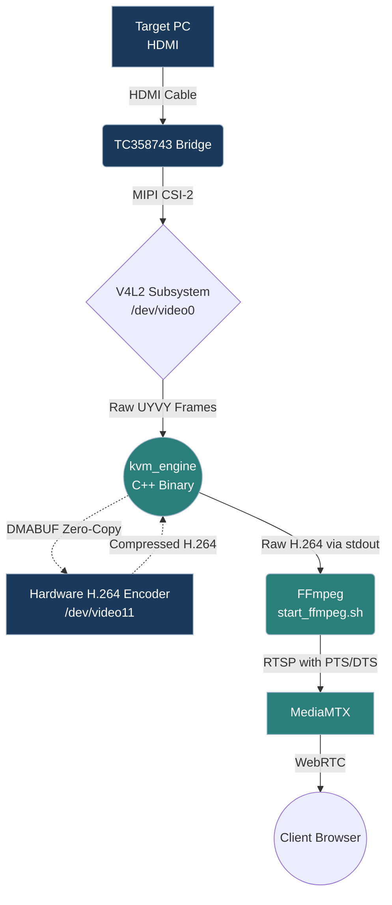

# IP-KVM — Autonomous Raspberry Pi 4 Device

A self-contained KVM-over-IP device built on a Raspberry Pi 4 Model B. A single Python
orchestrator (`kvm_engine_py`) runs everything on the board: hardware-accelerated video
capture and H.264 streaming, USB HID emulation (keyboard/mouse), an optional front-panel
controller, **and** the web control plane (authentication, node metadata, WebRTC
signaling). There is **no external backend and no database** — the device depends on
nothing but itself and the local network.

> **Autonomy is the design goal.** The repository contains no personal data (no usernames,
> hostnames, domains, IPs, or secrets baked into code). All deployment-specific values come
> from a single `.env`, and secrets are generated on the device at provisioning time. A
> clean Raspberry Pi can be turned into a working unit with one provisioning script.

---

## Quick start

### From a blank SD card (provisioning)

1. Flash Raspberry Pi OS (64-bit, Bookworm+) with **Raspberry Pi Imager**, setting the user,
   hostname, SSH, and locale there.
2. SSH in as that user, clone this repo, and run the provisioner:

   ```bash
   git clone <repo-url> ~/kvm_engine_py
   cd ~/kvm_engine_py
   sudo ./provisioning/provision.sh --dry-run   # review what it will do (changes nothing)
   sudo ./provisioning/provision.sh             # apply
   sudo reboot                                  # required: boot-config + kernel modules
   ```

3. After reboot the device starts automatically (systemd). Open `http://<hostname>.lan` in a
   browser and log in with the device password set during provisioning.

See [Provisioning](#provisioning-bare-metal) for what each step does.

### Daily operation (after provisioning)

The orchestrator runs as a systemd service — no manual `python -m app.main run` needed:

```bash
sudo systemctl status kvm-engine        # state
sudo systemctl restart kvm-engine       # after a git pull / config change
journalctl -u kvm-engine -f             # live logs
```

> Do not run `python -m app.main run` by hand while the service is active — both would
> contend for the same hardware and ports. Stop the service first for manual development runs.

---

## Architecture overview

The system follows an **Event-Driven Orchestrator** pattern, where Python acts as the
"brain" managing high-performance components:

- **Hardware Layer (`app/hardware/`)**: Native Python for Linux ConfigFS (USB Gadget) and
  V4L2 (video bridge) init. Includes the optional front-panel module (`front_panel.py`) for
  RP2040-Zero UART integration.
- **Service Layer (`app/services/`)**: `ProjectBuilder` (automated C++/GCC compilation) and
  `ServiceManager` (asyncio lifecycle management for MediaMTX, the WebSocket server, and
  hardware monitors).
- **Control Plane (`app/auth/`, node/signaling handlers)**: serves the web control plane
  in-process — login/refresh, node self-metadata, and WebRTC signaling. JWT-authenticated,
  no database.
- **WebSocket/HTTP Layer (`app/ws/`)**: A single shared `WSServer` (aiohttp) on one port
  (`8080`). All routes — auth, nodes, signaling, `/ws/control`, `/ws/front_panel`,
  `/ws/wake` — are registered on it at startup.
- **HID Layer (`app/hid/`)**: Translates WebSocket commands into low-level USB HID reports
  written to the ConfigFS gadget endpoints (`/dev/hidg0`, `/dev/hidg1`). Also holds the JWT
  validator reused across the control plane.
- **Execution Layer (`src/`)**: `kvm_engine` (C++, hardware-accelerated H.264 via V4L2) and
  `MediaMTX` (WebRTC/RTSP streaming server).
- **Web front (`web/`)**: The pre-built single-page app, vendored into the repo and served
  by Caddy. See [Single-origin web](#single-origin-web).

---

## Video pipeline (zero-copy)



1. **Target PC (HDMI)** → physical HDMI cable to the capture board.
2. **TC358743 Bridge**: HDMI→MIPI CSI-2 chip, initialized by `HardwareManager` via V4L2,
   exposing `/dev/video0`. EDID is loaded from `config/720p60edid` (vendored in the repo).
3. **`kvm_engine` (C++)**: captures raw frames from `/dev/video0` and pipes them to the Pi's
   hardware H.264 encoder (`/dev/video11`) via zero-copy DMABUF, emitting raw H.264 to stdout.
4. **FFmpeg (`start_ffmpeg.sh`)**: attaches PTS/DTS without re-encoding (`-c:v copy`) and
   pushes the stream over RTSP to a loopback address.
5. **MediaMTX**: on-demand streaming server. Receives the RTSP ingest and serves WebRTC to
   the browser. The WebRTC media itself flows **directly** over UDP (port `30000`) between
   browser and device, not through the signaling path.

> `mediamtx.yml` is generated at startup from `config/mediamtx.yml.j2`. Only WebRTC and a
> loopback-only RTSP ingest are enabled; RTMP/HLS/SRT and the UDP-RTP listeners are off.

---

## On-device control plane (API)

The device serves its own control-plane API. All paths are also accepted without the
`/api/v1` prefix. Everything except login/refresh requires a valid access token.

### Authentication (`app/auth/`)

Single device password (bcrypt hash in `.env`); JWT pair, HS256, signed with
`KVM_JWT_SECRET`. Claims: `sub`, `type` (`access`|`refresh`), `iat`, `exp`.

| Method / Path | Body | Response |
|---|---|---|
| `POST /api/v1/auth/login` | form: `username`, `password` | `{access_token, refresh_token, token_type:"bearer"}` |
| `POST /api/v1/auth/refresh` | JSON: `{refresh_token}` | same token pair |

### Node metadata

The device reports **itself** as a single node (no registry, no DB).

| Method / Path | Response |
|---|---|
| `GET /api/v1/nodes` | array with exactly one element — this node |
| `GET /api/v1/nodes/{node_id}` | the same node (`node_id` ignored — always self) |
| `GET /api/v1/nodes/{node_id}/status` | `{id, status, last_seen_at}` |

Node object exposes only public fields: `id`, `name`, `status`, `stream_name`,
`has_front_panel`, `machine_info`, `screenshot`, `last_seen_at`, `created_at`, `tunnel_url`,
`ws_port`, `mediamtx_api_port`. MediaMTX credentials and internal IPs are **never** exposed.

### WebRTC signaling (proxy to local MediaMTX)

| Method / Path | Action |
|---|---|
| `POST /api/v1/nodes/{node_id}/signal/offer` | forwards the SDP offer to local MediaMTX WHEP (`127.0.0.1:8889/{stream}/whep`); returns `{sdp, type:"answer", session_url}` |
| `POST /api/v1/nodes/{node_id}/signal/ice` | forwards a trickle-ICE candidate to the session; `204 No Content` |

### Wake, control, front panel

See [Wake endpoint](#wake-endpoint) and [Front-panel module](#front-panel-module-optional).
HID control is `ws://<host>/ws/control?token=<JWT>`.

---

## Single-origin web

The SPA, the API, and the WebSocket channels are all served from **one origin** via a Caddy
reverse proxy, so the browser uses relative URLs and the same build works at any address
(LAN IP, `*.lan`, VPN name, public domain) without rebuilding.

```
http(s)://<host>/
    /api/*  -> engine (127.0.0.1:8080)
    /ws/*   -> engine (127.0.0.1:8080)   (control, front_panel, wake; WebSocket)
    else    -> static SPA from ./web/    (history-mode fallback to /index.html)
```

Caddy listens on `:80` (plain HTTP is fine on a trusted LAN). HTTPS is provided by the
optional external-access layer (see below); the SPA switches `ws → wss` automatically based
on the page scheme.

### Building and vendoring the SPA

The front-end lives in a separate repo. Build it with an **empty** `VITE_API_BASE_URL` (so
all calls are relative), then commit the output into `web/`:

```bash
# in the frontend repo:
VITE_API_BASE_URL="" npm run build
# copy dist/* into this repo's web/ and commit it
```

No Node.js runs on the device — only the static bundle is served.

---

## Provisioning (bare-metal)

`provisioning/provision.sh` turns a fresh Raspberry Pi OS install into a working device.
Run as the project-owning user via `sudo`. It supports `--dry-run` (print actions, change
nothing) and running a single step by name (e.g. `sudo ./provisioning/provision.sh 40_build`).
Every step is idempotent; the device user and paths are derived from `SUDO_USER`, never
hardcoded.

| Step | What it does |
|---|---|
| `00_packages` | apt: `build-essential git python3-venv ffmpeg v4l-utils` (no cmake, no dev-headers) |
| `10_boot_config` | appends required overlays to `config.txt` (never overwrites; backs it up) and writes `/etc/modules-load.d/kvm-usb.conf` |
| `20_mediamtx` | installs the pinned MediaMTX `arm64` binary into `../mediamtx` |
| `30_python_env` | creates the venv and installs `requirements.txt` |
| `40_build` | compiles the C++ engine with `g++` (mirrors `app/services/builder.py`) |
| `50_secrets` | creates `.env`, runs `gen_secrets.py` (prompts for the device password) |
| `60_service` | installs and enables `kvm-engine.service` (does not start — reboot required) |
| `70_caddy` | installs Caddy, renders the Caddyfile, serves `web/` single-origin |

`provision.env.example` holds the optional parameters (interface name, pinned versions).

### Boot configuration applied

- `config.txt`: `dtoverlay=tc358743` (capture), `dtoverlay=dwc2` (USB gadget),
  `enable_uart=1` + `dtoverlay=disable-bt` (front-panel UART on `/dev/ttyAMA0`),
  `gpu_mem=256`; the stock `dtoverlay=vc4-kms-v3d,cma-256` supplies CMA for DMABUF.
- `/etc/modules-load.d/kvm-usb.conf`: `dwc2`, `libcomposite` (required for the HID gadget).

> Hardware target is the **Pi 4 Model B** — the C++ build uses `-mcpu=cortex-a72`.

---

## External access (optional)

The device is fully functional on the LAN with none of this. For remote access there are two
proposed paths; the department may use other methods. Full details, steps, and the rationale
are in [`docs/external-access.md`](docs/external-access.md).

- **Tailscale (recommended, verified):** carries both control traffic and the WebRTC UDP
  media natively, provides HTTPS via `tailscale serve`, no public IP or port-forwarding.
- **Cloudflare Tunnel:** good for "any browser anywhere", but the tunnel only carries
  HTTP/HTTPS — **WebRTC video (UDP) does not pass through it**, so video additionally needs a
  forwarded UDP port or a TURN server. See the doc for the full explanation.

HTTPS also re-enables browser **Keyboard Lock** in fullscreen, so `Esc`/`Tab`/`Alt`/`Meta`
reach the target PC instead of leaving fullscreen.

---

## Wake endpoint

`POST /ws/wake` — an HTTP endpoint (not a WebSocket) that sends a USB wakeup signal to the
target PC.

```
POST /ws/wake
Authorization: Bearer <JWT>            # or  /ws/wake?token=<JWT>
```

| Status | Body | Condition |
|---|---|---|
| `200` | `{"status":"ok"}` | Wake signal sent |
| `401` | `Unauthorized: Missing token` | No token |
| `401` | `Unauthorized: Invalid token` | Token invalid/expired |
| `500` | `{"status":"error","message":"wake operation failed"}` | Hardware error |

**Behavior:** USB gadget rebind (`force_rebind_gadget`) then the wake sequence (`wake_host`),
both in a thread executor. **Availability:** registered only when hardware is present
(not with `--no-hw`).

---

## Front-panel module (optional)

An RP2040-Zero add-on controls the target PC's front-panel connectors over UART.

- Send Power/Reset events (`power_press`, `power_hold`, `reset`).
- Read PWR_LED and HDD_LED states (`on`, `off`, `blinking`, `idle`, `active`, `unknown`).
- Connection: Pi GPIO14/15 (UART0) ↔ RP2040 GP0/GP1 @ 115200 baud, 3.3 V TTL.
- Startup: up to 5 ping probes (200 → 3000 ms back-off); if absent, the subsystem disables
  itself with a `WARN` and everything else continues.

Config (`.env`): `KVM_FRONT_PANEL_ENABLED` (default `true`), `KVM_FRONT_PANEL_PORT`
(`/dev/ttyAMA0`), `KVM_FRONT_PANEL_BAUDRATE` (`115200`).

WebSocket: `ws://<host>/ws/front_panel?token=<JWT>`.

| Server → client | Description |
|---|---|
| `{"type":"led_status","pwr":"on","hdd":"idle"}` | LED state, ~10 Hz |
| `{"type":"ack","cmd":"power_press"}` | Command confirmed |
| `{"type":"error","reason":"..."}` | `not_connected` / `malformed_json` / `unknown_command` / `internal` |

Client → server: `{"type":"power_press"}`, `{"type":"power_hold"}`, `{"type":"reset"}`.
Protocol details: `firmware/uart_protocol.md`. The RP2040 firmware (`firmware/`) is flashed
as a separate one-off step, not part of `provision.sh`.

---

## Configuration

Configured via environment variables, loaded from `.env` at the project root.

- `.env` — **single source of truth** for all deployment settings and secrets. Git-ignored;
  see `.env.example`. Secrets (`KVM_JWT_SECRET`, `KVM_MEDIAMTX_PASS`, the device password
  hash) are generated by `scripts/gen_secrets.py` and never committed.
- `config/config.json.example` — static schema for the C++ engine; the real `config.json` is
  rendered from it plus `.env` at startup.
- `config/mediamtx.yml.j2` — Jinja2 template; the real `mediamtx.yml` is rendered at startup.
- `config/720p60edid` — the EDID blob, vendored in the repo (no external download needed).

### Manual execution (development)

```bash
sudo systemctl stop kvm-engine          # if the service is running
python -m app.main run --build          # build C++ then start everything
python -m app.main run                  # start without rebuilding
python -m app.main run --no-hw          # no hardware (dev; disables /ws/wake)
python -m app.main wake                 # one-shot USB wake (no server)
```

### Prerequisites

Raspberry Pi 4 Model B with a TC358743 capture bridge; `g++` and Python 3.10+ (installed by
provisioning).
