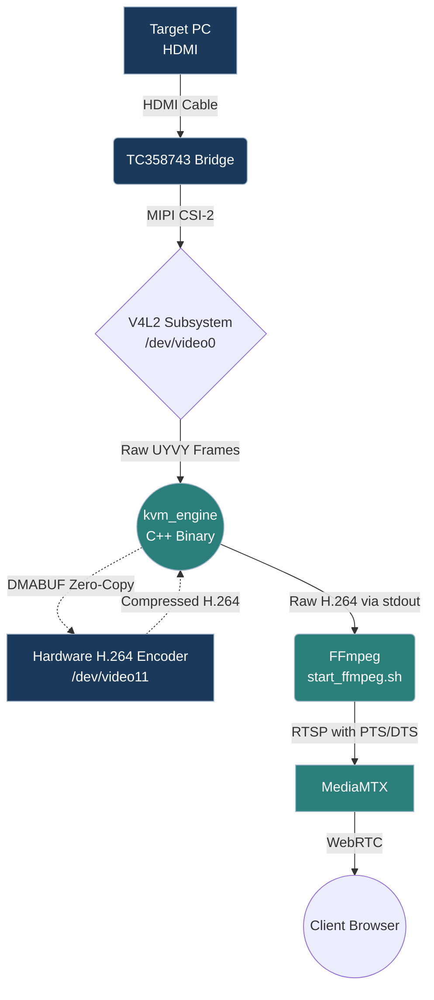

# IP-KVM — автономний пристрій на Raspberry Pi 4

Самодостатній пристрій KVM-over-IP на базі Raspberry Pi 4 Model B. Єдиний Python-оркестратор
(`kvm_engine_py`) виконує на платі все: апаратне захоплення відео та стримінг H.264, емуляцію
USB HID (клавіатура/миша), опційний контролер передньої панелі **і** веб-частину
(автентифікація, метадані вузла, WebRTC-сигналінг). Зовнішнього бекенда й бази даних
**немає** — пристрій не залежить ні від чого, крім самого себе й локальної мережі.

> **Автономність — ціль проєкту.** У репозиторії немає особистих даних (жодних імен
> користувачів, хостів, доменів, IP чи секретів, зашитих у код). Усі деплой-специфічні
> значення беруться з єдиного `.env`, а секрети генеруються на пристрої під час
> провіженінгу. Чиста Raspberry Pi перетворюється на робочий пристрій одним скриптом.

---

## Швидкий старт

### З чистої SD-картки (провіженінг)

1. Запиши Raspberry Pi OS (64-біт, Bookworm+) через **Raspberry Pi Imager**, задавши там
   користувача, hostname, SSH і локаль.
2. Зайди по SSH цим користувачем, клонуй репозиторій і запусти провіженер:

   ```bash
   git clone <repo-url> ~/kvm_engine_py
   cd ~/kvm_engine_py
   sudo ./provisioning/provision.sh --dry-run   # подивитись, що буде зроблено (нічого не міняє)
   sudo ./provisioning/provision.sh             # застосувати
   sudo reboot                                  # обов'язково: boot-конфіг + модулі ядра
   ```

3. Після перезавантаження пристрій стартує сам (systemd). Відкрий `http://<hostname>.lan` у
   браузері й увійди паролем пристрою, заданим під час провіженінгу.

Що робить кожен крок — див. [Провіженінг](#провіженінг-bare-metal).

### Щоденна робота (після провіженінгу)

Оркестратор працює як служба systemd — ручний `python -m app.main run` не потрібен:

```bash
sudo systemctl status kvm-engine        # стан
sudo systemctl restart kvm-engine       # після git pull / зміни конфігу
journalctl -u kvm-engine -f             # живі логи
```

> Не запускай `python -m app.main run` руками, поки служба активна — обидва процеси
> конкуруватимуть за те саме залізо й порти. Для ручної розробки спершу зупини службу.

---

## Огляд архітектури

Система побудована за шаблоном **Event-Driven Orchestrator**, де Python — це «мозок», що
керує високопродуктивними компонентами:

- **Шар заліза (`app/hardware/`)**: нативний Python для Linux ConfigFS (USB-gadget) і V4L2
  (відеоміст). Містить опційний модуль передньої панелі (`front_panel.py`) для інтеграції з
  RP2040-Zero по UART.
- **Сервісний шар (`app/services/`)**: `ProjectBuilder` (автоматична компіляція C++/GCC) і
  `ServiceManager` (керування життєвим циклом MediaMTX, WebSocket-сервера й моніторів заліза
  через asyncio).
- **Control plane (`app/auth/`, обробники вузла/сигналінгу)**: веб-частина працює в тому ж
  процесі — логін/refresh, self-метадані вузла та WebRTC-сигналінг. JWT-автентифікація, без
  бази даних.
- **Шар WebSocket/HTTP (`app/ws/`)**: єдиний спільний `WSServer` (aiohttp) на одному порту
  (`8080`). Усі маршрути — auth, nodes, signaling, `/ws/control`, `/ws/front_panel`,
  `/ws/wake` — реєструються на ньому при старті.
- **Шар HID (`app/hid/`)**: перетворює WebSocket-команди на низькорівневі USB HID-звіти,
  які пишуться в ConfigFS-ендпоінти gadget'а (`/dev/hidg0`, `/dev/hidg1`). Тут же — JWT-валідатор,
  спільний для всього control plane.
- **Шар виконання (`src/`)**: `kvm_engine` (C++, апаратний H.264 через V4L2) і `MediaMTX`
  (стримінг-сервер WebRTC/RTSP).
- **Веб-фронт (`web/`)**: попередньо зібраний SPA, вкладений у репозиторій і роздаваний
  Caddy. Див. [Single-origin веб](#single-origin-веб).

---

## Відео-пайплайн (zero-copy)



1. **Target PC (HDMI)** → фізичний HDMI-кабель до плати захоплення.
2. **TC358743**: чип HDMI→MIPI CSI-2, ініціалізується `HardwareManager` через V4L2 і виставляє
   `/dev/video0`. EDID завантажується з `config/720p60edid` (вкладений у репозиторій).
3. **`kvm_engine` (C++)**: захоплює сирі кадри з `/dev/video0` і передає їх в апаратний H.264-кодер
   Pi (`/dev/video11`) через zero-copy DMABUF, видаючи сирий H.264 у stdout.
4. **FFmpeg (`start_ffmpeg.sh`)**: додає таймстемпи PTS/DTS без перекодування (`-c:v copy`) і
   пушить потік по RTSP на loopback-адресу.
5. **MediaMTX**: стримінг-сервер on-demand. Приймає RTSP-заливку й віддає WebRTC у браузер.
   Саме відео (медіа) йде **напряму** по UDP (порт `30000`) між браузером і пристроєм, а не
   через сигнальний канал.

> `mediamtx.yml` генерується при старті з `config/mediamtx.yml.j2`. Увімкнено лише WebRTC і
> RTSP-заливку на loopback; RTMP/HLS/SRT та UDP-RTP-слухачі вимкнені.

---

## On-device control plane (API)

Пристрій обслуговує власну веб-частину (API). Усі шляхи приймаються також без префікса
`/api/v1`. Усе, окрім login/refresh, вимагає дійсного access-токена.

### Автентифікація (`app/auth/`)

Один пароль пристрою (bcrypt-хеш у `.env`); JWT-пара, HS256, підписана `KVM_JWT_SECRET`.
Claim'и: `sub`, `type` (`access`|`refresh`), `iat`, `exp`.

| Метод / Шлях | Тіло | Відповідь |
|---|---|---|
| `POST /api/v1/auth/login` | form: `username`, `password` | `{access_token, refresh_token, token_type:"bearer"}` |
| `POST /api/v1/auth/refresh` | JSON: `{refresh_token}` | та сама пара токенів |

### Метадані вузла

Пристрій повідомляє про **себе** як про єдиний вузол (без реєстру, без БД).

| Метод / Шлях | Відповідь |
|---|---|
| `GET /api/v1/nodes` | масив з одного елемента — цей вузол |
| `GET /api/v1/nodes/{node_id}` | той самий вузол (`node_id` ігнорується — завжди self) |
| `GET /api/v1/nodes/{node_id}/status` | `{id, status, last_seen_at}` |

Об'єкт вузла віддає лише публічні поля: `id`, `name`, `status`, `stream_name`,
`has_front_panel`, `machine_info`, `screenshot`, `last_seen_at`, `created_at`, `tunnel_url`,
`ws_port`, `mediamtx_api_port`. Креди MediaMTX і внутрішні IP **ніколи** не віддаються.

### WebRTC-сигналінг (проксі до локального MediaMTX)

| Метод / Шлях | Дія |
|---|---|
| `POST /api/v1/nodes/{node_id}/signal/offer` | передає SDP-offer у локальний MediaMTX WHEP (`127.0.0.1:8889/{stream}/whep`); повертає `{sdp, type:"answer", session_url}` |
| `POST /api/v1/nodes/{node_id}/signal/ice` | передає trickle-ICE кандидата в сесію; `204 No Content` |

### Wake, керування, передня панель

Див. [Wake-ендпоінт](#wake-ендпоінт) і [Модуль передньої панелі](#модуль-передньої-панелі-опційний).
HID-керування — `ws://<host>/ws/control?token=<JWT>`.

---

## Single-origin веб

SPA, API і WebSocket-канали віддаються з **одного походження** через reverse-proxy Caddy,
тож браузер використовує відносні URL, і той самий білд працює за будь-якою адресою
(локальний IP, `*.lan`, VPN-ім'я, публічний домен) **без перезбірки**.

```
http(s)://<host>/
    /api/*  -> engine (127.0.0.1:8080)
    /ws/*   -> engine (127.0.0.1:8080)   (control, front_panel, wake; WebSocket)
    інше    -> статика SPA з ./web/      (history-режим: фолбек на /index.html)
```

Caddy слухає `:80` (звичайний HTTP у довіреній LAN — нормально). HTTPS дає опційний шар
зовнішнього доступу (нижче); SPA сам перемикає `ws → wss` за схемою сторінки.

### Збірка й вкладання SPA

Фронт лежить в окремому репозиторії. Збери його з **порожнім** `VITE_API_BASE_URL` (щоб усі
виклики були відносними), потім поклади результат у `web/`:

```bash
# у репозиторії фронта:
VITE_API_BASE_URL="" npm run build
# скопіюй dist/* у web/ цього репозиторію й закоміть
```

На пристрої Node.js не запускається — роздається лише статичний бандл.

---

## Провіженінг (bare-metal)

`provisioning/provision.sh` перетворює свіже встановлення Raspberry Pi OS на робочий пристрій.
Запускається користувачем-власником проєкту через `sudo`. Підтримує `--dry-run` (друкує дії,
нічого не змінює) і запуск окремого кроку за назвою (напр. `sudo ./provisioning/provision.sh 40_build`).
Кожен крок ідемпотентний; користувач і шляхи беруться з `SUDO_USER`, ніколи не хардкодяться.

| Крок | Що робить |
|---|---|
| `00_packages` | apt: `build-essential git python3-venv ffmpeg v4l-utils` (без cmake, без dev-заголовків) |
| `10_boot_config` | додає потрібні overlay у `config.txt` (ніколи не перезаписує; робить бекап) і пише `/etc/modules-load.d/kvm-usb.conf` |
| `20_mediamtx` | ставить фіксовану версію бінарника MediaMTX `arm64` у `../mediamtx` |
| `30_python_env` | створює venv і ставить `requirements.txt` |
| `40_build` | компілює C++-движок через `g++` (дзеркало `app/services/builder.py`) |
| `50_secrets` | створює `.env`, запускає `gen_secrets.py` (запитує пароль пристрою) |
| `60_service` | ставить і вмикає `kvm-engine.service` (не стартує — потрібен ребут) |
| `70_caddy` | ставить Caddy, рендерить Caddyfile, роздає `web/` single-origin |

`provision.env.example` містить опційні параметри (назва інтерфейсу, фіксовані версії).

### Що застосовується в boot-конфізі

- `config.txt`: `dtoverlay=tc358743` (захоплення), `dtoverlay=dwc2` (USB-gadget),
  `enable_uart=1` + `dtoverlay=disable-bt` (UART передньої панелі на `/dev/ttyAMA0`),
  `gpu_mem=256`; штатний `dtoverlay=vc4-kms-v3d,cma-256` дає CMA для DMABUF.
- `/etc/modules-load.d/kvm-usb.conf`: `dwc2`, `libcomposite` (потрібні для HID-gadget'а).

> Цільове залізо — **Pi 4 Model B**: C++-збірка використовує `-mcpu=cortex-a72`.

---

## Зовнішній доступ (опційно)

У локальній мережі пристрій повністю працездатний без усього цього. Для віддаленого доступу
є два запропоновані шляхи; кафедра може застосувати інші методи. Повні деталі, кроки й
обґрунтування — у [`docs/external-access_UKR.md`](docs/external-access_UKR.md).

- **Tailscale (рекомендований, перевірений):** несе і керуючий трафік, і WebRTC-медіа (UDP)
  нативно, дає HTTPS через `tailscale serve`, без публічного IP і проброса портів.
- **Cloudflare Tunnel:** добрий для «будь-який браузер де завгодно», але тунель проводить лише
  HTTP/HTTPS — **відео-WebRTC (UDP) через нього не йде**, тож відео додатково потребує
  проброса UDP-порту або TURN-сервера. Пояснення — в документі.

HTTPS також повертає браузерний **Keyboard Lock** у повноекранному режимі, тож
`Esc`/`Tab`/`Alt`/`Meta` йдуть на цільовий ПК, а не виходять з fullscreen.

---

## Wake-ендпоінт

`POST /ws/wake` — HTTP-ендпоінт (не WebSocket), що шле сигнал USB-пробудження цільовому ПК.

```
POST /ws/wake
Authorization: Bearer <JWT>            # або  /ws/wake?token=<JWT>
```

| Статус | Тіло | Умова |
|---|---|---|
| `200` | `{"status":"ok"}` | Сигнал надіслано |
| `401` | `Unauthorized: Missing token` | Немає токена |
| `401` | `Unauthorized: Invalid token` | Токен недійсний/протермінований |
| `500` | `{"status":"error","message":"wake operation failed"}` | Помилка заліза |

**Поведінка:** rebind USB-gadget'а (`force_rebind_gadget`), потім послідовність пробудження
(`wake_host`), обидві — у thread executor. **Доступність:** маршрут реєструється лише за
наявності заліза (не з `--no-hw`).

---

## Модуль передньої панелі (опційний)

Додаток на RP2040-Zero керує конекторами передньої панелі цільового ПК по UART.

- Надсилання подій Power/Reset (`power_press`, `power_hold`, `reset`).
- Читання станів PWR_LED і HDD_LED (`on`, `off`, `blinking`, `idle`, `active`, `unknown`).
- З'єднання: Pi GPIO14/15 (UART0) ↔ RP2040 GP0/GP1 @ 115200 бод, 3.3 В TTL.
- Старт: до 5 ping-проб (back-off 200 → 3000 мс); якщо плати немає, підсистема вимикається
  сама з `WARN`, решта працює далі.

Конфіг (`.env`): `KVM_FRONT_PANEL_ENABLED` (дефолт `true`), `KVM_FRONT_PANEL_PORT`
(`/dev/ttyAMA0`), `KVM_FRONT_PANEL_BAUDRATE` (`115200`).

WebSocket: `ws://<host>/ws/front_panel?token=<JWT>`.

| Сервер → клієнт | Опис |
|---|---|
| `{"type":"led_status","pwr":"on","hdd":"idle"}` | Стан LED, ~10 Гц |
| `{"type":"ack","cmd":"power_press"}` | Команду підтверджено |
| `{"type":"error","reason":"..."}` | `not_connected` / `malformed_json` / `unknown_command` / `internal` |

Клієнт → сервер: `{"type":"power_press"}`, `{"type":"power_hold"}`, `{"type":"reset"}`.
Деталі протоколу: `firmware/uart_protocol.md`. Прошивка RP2040 (`firmware/`) заливається
окремим разовим кроком, не частиною `provision.sh`.

---

## Конфігурація

Налаштовується змінними середовища, що завантажуються з `.env` у корені проєкту.

- `.env` — **єдине джерело істини** для всіх деплой-налаштувань і секретів. Ігнорується git;
  див. `.env.example`. Секрети (`KVM_JWT_SECRET`, `KVM_MEDIAMTX_PASS`, хеш пароля пристрою)
  генерує `scripts/gen_secrets.py`; вони ніколи не комітяться.
- `config/config.json.example` — статична схема для C++-движка; реальний `config.json`
  рендериться з неї плюс `.env` при старті.
- `config/mediamtx.yml.j2` — Jinja2-шаблон; реальний `mediamtx.yml` рендериться при старті.
- `config/720p60edid` — EDID-блоб, вкладений у репозиторій (зовнішнє завантаження не потрібне).

### Ручний запуск (розробка)

```bash
sudo systemctl stop kvm-engine          # якщо служба запущена
python -m app.main run --build          # зібрати C++ і запустити все
python -m app.main run                  # запуск без перезбірки
python -m app.main run --no-hw          # без заліза (розробка; вимикає /ws/wake)
python -m app.main wake                 # одноразовий USB-wake (без сервера)
```

### Передумови

Raspberry Pi 4 Model B з платою захоплення TC358743; `g++` і Python 3.10+ (ставляться
провіженінгом).
