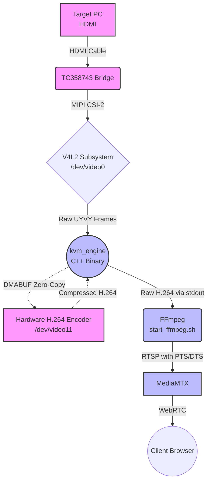

# IP-KVM Orchestrator (Python-based)

A unified orchestrator for Raspberry Pi 4 IP-KVM, managing hardware-accelerated video streaming and HID emulation.

## Architecture Overview

The system follows an **Event-Driven Orchestrator** pattern, where Python acts as the "brain" managing high-performance components:

- **Hardware Layer (`app/hardware/`)**: Native Python implementation for Linux ConfigFS (USB Gadget) and V4L2 (Video Bridge) initialization. Includes optional front-panel module (`front_panel.py`) for RP2040-Zero UART integration.
- **Service Layer (`app/services/`)**: 
    - `ProjectBuilder`: Automated C++ (GCC) compiler orchestration.
    - `ServiceManager`: Asyncio-based lifecycle management for background processes (`MediaMTX`, WebSocket server, and hardware monitors).
- **WebSocket Layer (`app/ws/`)**: Single shared `WSServer` (aiohttp) listening on one port. All WebSocket routes (`/ws/control`, `/ws/front_panel`) and HTTP routes (`POST /ws/wake`) are registered on it at startup. JWT-authenticated.
- **HID Layer (`app/hid/`)**: Translates incoming WebSocket commands into low-level USB HID reports (keyboard and mouse) written directly to the Linux ConfigFS gadget endpoints (`/dev/hidg0`, `/dev/hidg1`).
- **Execution Layer (`src/`)**:
    - `kvm_engine` (C++): Hardware-accelerated H.264 encoding via V4L2.
    - `MediaMTX`: High-efficiency WebRTC/RTSP streaming server.

## Video Pipeline (Zero-Copy)

The most critical part of the system is the low-latency video transmission pipeline. The signal flows through several hardware and software layers before reaching the client's browser:



1. **Target PC (HDMI)** → Physical HDMI cable connected to the capture board.
2. **TC358743 Bridge**: Hardware chip that converts HDMI to MIPI CSI-2. Initialized by `HardwareManager` (`app/hardware/manager.py`) via V4L2 to expose `/dev/video0`.
3. **`kvm_engine` (C++)**: Custom high-performance binary (`src/video_engine/`). It captures raw frames from `/dev/video0` and pipes them directly to the Raspberry Pi's hardware H.264 encoder (e.g., `/dev/video11`) using a zero-copy DMABUF mechanism. It outputs a raw H.264 stream to `stdout`.
4. **FFmpeg (`start_ffmpeg.sh`)**: Acts as a lightweight wrapper. It reads the raw H.264 from `kvm_engine` via stdin (`|`), attaches correct PTS/DTS timing data without re-encoding (`-c:v copy`), and pushes it as an RTSP stream.
5. **MediaMTX**: An ultra-fast streaming server triggered on-demand (`config/mediamtx.yml`). It receives the RTSP stream from FFmpeg and serves it to the client's browser using **WebRTC** for sub-second latency. (Note: `mediamtx.yml` is generated dynamically from `config/mediamtx.yml.j2` at startup).

## Component Interaction

1. **Initialization**: Loads configuration from the environment and `.env` using Pydantic Settings, dynamically generates the necessary configuration files (`config.json` and `mediamtx.yml`), and configures Hardware (USB HID Gadgets & Video Bridge).
2. **Build**: Compiles C++ binaries if requested.
3. **Runtime**: Orchestrates `mediamtx`, the shared `WSServer`, HID logic, and the optional front-panel UART bridge as concurrent asyncio tasks inside a single `TaskGroup`. `MediaMTX` triggers the `kvm_engine` pipeline via internal configuration.
4. **Shutdown**: Graceful termination of all subprocesses and resource cleanup via Context Managers.

## Usage

### Prerequisites
- Raspberry Pi 4 with TC358743 Video Bridge.
- G++ and Python 3.10+ installed.

### Execution
Run the orchestrator (use `sudo` for hardware access):
```bash
# Build and start all services
python -m app.main run --build

# Start without rebuilding
python -m app.main run

# Start without hardware (development mode, no /ws/wake route)
python -m app.main run --no-hw

# Send USB wakeup signal to host (CLI, no server required)
python -m app.main wake
```

## Wake Endpoint

`POST /ws/wake` — HTTP endpoint (not WebSocket) that sends a USB wakeup signal to the target PC. The path prefix `/ws/` is kept for backward compatibility with Go-era clients.

**Request:**
```
POST /ws/wake
Authorization: Bearer <JWT>
```
Or via query parameter (for compatibility with `/ws/control`):
```
POST /ws/wake?token=<JWT>
```

**Responses:**

| Status | Body | Condition |
|---|---|---|
| `200` | `{"status":"ok"}` | Wake signal sent successfully |
| `401` | `Unauthorized: Missing token` | No token provided |
| `401` | `Unauthorized: Invalid token` | Token invalid or expired |
| `500` | `{"status":"error","message":"wake operation failed"}` | Hardware error |

**Behavior:** Performs a USB gadget rebind (`force_rebind_gadget`) followed by the wake sequence (`wake_host`). Both operations run in a thread executor to avoid blocking the event loop.

**Availability:** The route is registered only when hardware is available (i.e. not running with `--no-hw`).

## Front-Panel Module (Optional)

An optional hardware add-on based on the RP2040-Zero microcontroller provides remote control of the target PC's front-panel connectors via UART.

**Capabilities:**
- Send Power/Reset button events (`power_press`, `power_hold`, `reset`)
- Read PWR\_LED and HDD\_LED states in real-time (`on`, `off`, `blinking`, `idle`, `active`, `unknown`)

**Hardware connection:** Raspberry Pi GPIO14/15 (UART0) ↔ RP2040-Zero GP0/GP1 at 115200 baud, 3.3 V TTL.

**Startup behavior:** At boot, `kvm_engine_py` probes the UART port with up to 5 ping attempts (exponential back-off: 200 → 3000 ms). If the board is not detected, the subsystem is disabled with a `WARN` log entry and all other services continue normally.

**Configuration** (via `.env` variables):

| Env Variable | Default | Description |
|---|---|---|
| `KVM_FRONT_PANEL_ENABLED` | `true` | Set to `false` to skip probe entirely |
| `KVM_FRONT_PANEL_PORT` | `/dev/ttyAMA0` | UART device path (Linux only) |
| `KVM_FRONT_PANEL_BAUDRATE` | `115200` | Baud rate |

On Windows / development machines without UART hardware, the probe fails gracefully — set `KVM_FRONT_PANEL_ENABLED=false` in your `.env` or run with the default (probe will time out and disable itself automatically).

**WebSocket API** (same port as HID, default `8080`):

```
ws://<host>:<hid_port>/ws/front_panel?token=<JWT>
```

Server → client frames:

| Frame | Description |
|---|---|
| `{"type":"led_status","pwr":"on","hdd":"idle"}` | LED state, ~10 Hz |
| `{"type":"ack","cmd":"power_press"}` | Command confirmed |
| `{"type":"error","reason":"not_connected"}` | Board unavailable |
| `{"type":"error","reason":"malformed_json"}` | Bad JSON from client |
| `{"type":"error","reason":"unknown_command","received":"..."}` | Unknown command |
| `{"type":"error","reason":"internal"}` | Unexpected server error |

Client → server frames: `{"type":"power_press"}`, `{"type":"power_hold"}`, `{"type":"reset"}`.

A slow client (send blocked > 1 s) is disconnected. Invalid or missing JWT → HTTP 401 before WebSocket upgrade.

Protocol details: `firmware/docs/uart_protocol.md`.

## Configuration

The system is configured using environment variables, typically loaded from a `.env` file at the root of the project.

Key files:
- `.env`: The single source of truth for all deployment settings and secrets. Refer to `.env.example` for details.
- `config/config.json.example`: Static structure template for the C++ video engine. The actual `config.json` is generated dynamically on startup.
- `config/mediamtx.yml.j2`: Jinja2 template for MediaMTX configuration. The actual `mediamtx.yml` is generated dynamically on startup.
